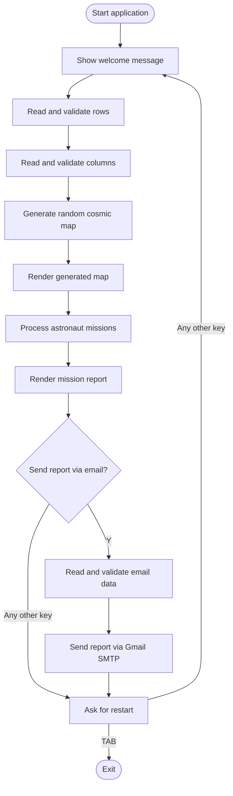
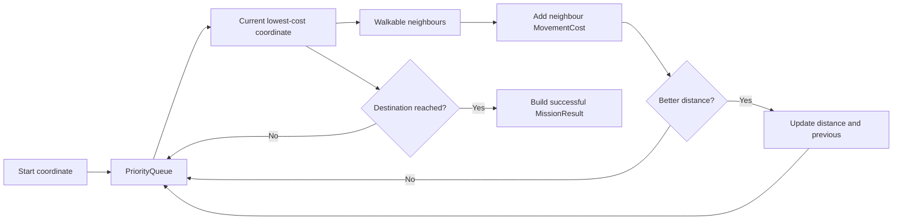
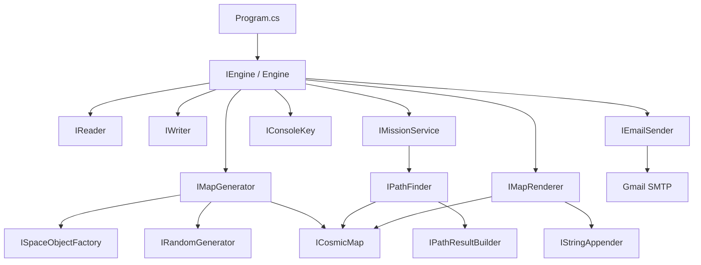
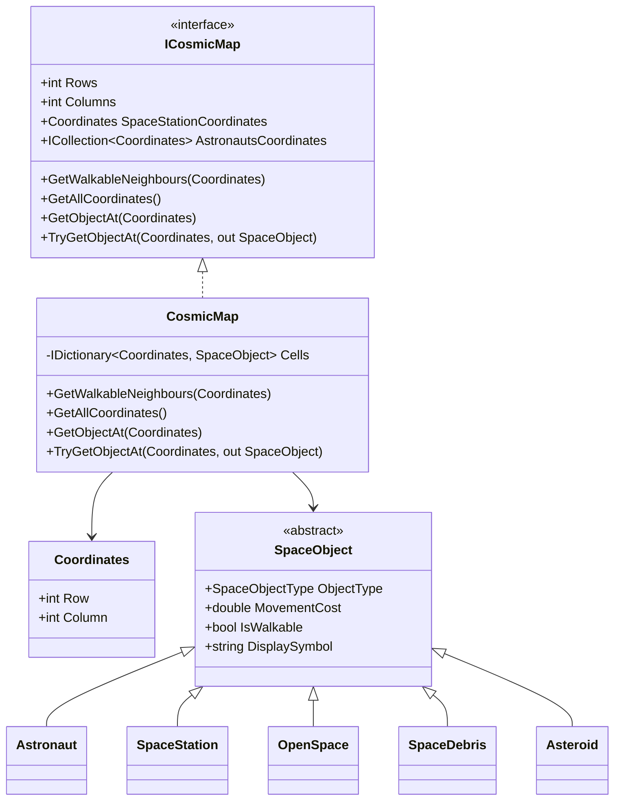
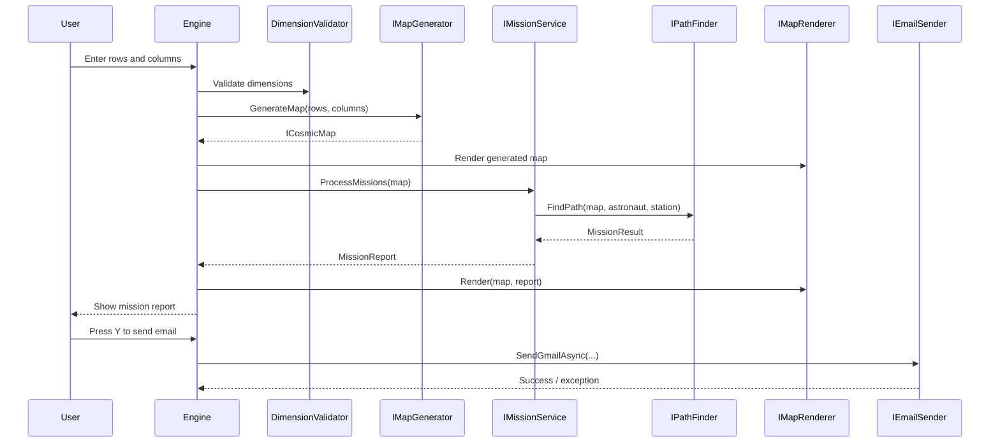
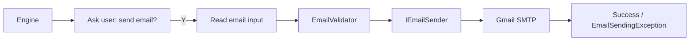

# Space Program — SPACE 2026 Console Mission

**Space Program** is a C#/.NET console application that simulates a rescue mission in a cosmic navigation map. The application generates a random space map, places one to three astronauts, locates the Space Station, and calculates each astronaut's safest route through open space, asteroids, and space debris.

The project was built as a solution for the **SPACE 2026 technical assessment**. The main goal is to guide multiple astronauts back to the Space Station by finding the shortest valid path, displaying the route visually, and reporting failed missions first when an astronaut cannot reach the destination.

> The implementation focuses on clean object-oriented design, swappable pathfinding algorithms, custom validation, structured error handling, console rendering, dynamic map generation, and optional SMTP email reporting.

---

## Contents

- [Project at a glance](#project-at-a-glance)
- [Mission rules](#mission-rules)
- [Implemented features](#implemented-features)
- [Input and output flow](#input-and-output-flow)
- [Pathfinding](#pathfinding)
- [Architecture](#architecture)
- [Domain model](#domain-model)
- [Application flow](#application-flow)
- [Email reporting](#email-reporting)
- [Validation and error handling](#validation-and-error-handling)
- [Tech stack](#tech-stack)
- [Getting started](#getting-started)
- [Screenshots](#screenshots)
- [Project structure](#project-structure)
- [Future improvements](#future-improvements)
- [License](#license)

---

## Project at a glance

The application starts by asking the user for the number of rows and columns of the cosmic map. The accepted map size is between **2 and 100** for both dimensions. After validation, a random map is generated and displayed.

Each generated map contains:

| Symbol | Meaning | Walkable | Movement cost |
|---|---|---:|---:|
| `S1`, `S2`, `S3` | Astronaut starting positions | Yes | 1 |
| `F` | Final destination / Space Station | Yes | 1 |
| `O` | Open space | Yes | 1 |
| `D` | Space debris | Yes | 2 |
| `X` | Asteroid | No | Not allowed |
| `*` | Calculated route segment | Output only | - |

The mission service processes every astronaut independently and creates a mission report. Failed missions are displayed first, while successful missions are sorted by total movement cost and then by astronaut name.

---

## Mission rules

The rules implemented in the project follow the assessment requirements:

- The application is a C#/.NET console application.
- The map dimensions must be within the allowed range: `2 <= rows <= 100` and `2 <= columns <= 100`.
- The map contains at least one astronaut and at most three astronauts.
- Astronauts can move only in four directions: up, down, left, and right.
- Asteroids are blocked cells and cannot be entered.
- The route is shown with `*`, without replacing the astronaut start position or the Space Station.
- Unreachable astronauts are reported as failed missions.
- Successful astronauts are ordered by shortest distance / total movement cost.
- Space debris is supported as a weighted cell with movement cost `2`.
- The active pathfinding algorithm can be swapped through the `IPathFinder` abstraction.
- The final report can optionally be sent by email using SMTP.

---

## Implemented features

### Dynamic cosmic map generation

The project does not rely on a hardcoded map. The user enters valid dimensions, and `RandomMapGenerator` creates a new cosmic environment. It randomly places the Space Station, generates between one and three astronauts, and fills the remaining cells with open space, asteroids, and space debris.

### Multiple astronaut processing

Every astronaut is processed independently. The application calculates a separate route from each astronaut's current position to the Space Station. A mission report groups successful and failed results.

### Weighted pathfinding with Dijkstra

The active algorithm in `Program.cs` is `DijkstraPathFinder`, which supports weighted cells. This allows the project to correctly handle `D` space debris, where passing through the cell costs `2` instead of `1`.

### Swappable pathfinding algorithms

The project also includes `BfsPathFinder`. Since both algorithms implement `IPathFinder`, the mission logic does not need to change when the algorithm is replaced.

```csharp
IPathResultBuilder builder = new PathResultBuilder();

IPathFinder dijkstra = new DijkstraPathFinder(builder);
IPathFinder bfs = new BfsPathFinder(builder);

IMissionService service = new MissionService(dijkstra);
```

### Console report rendering

`TextMapRenderer` renders the original map and the mission result maps. It uses `ICosmicMap` instead of depending directly on the concrete `CosmicMap` implementation, so the renderer does not need to know how the map stores its cells internally.

### Optional email report

After the mission report is rendered, the application asks the user whether the report should be sent by email. If the user presses `Y`, the application reads and validates the sender Gmail address, Gmail App Password, receiver email, and subject. The report body is the rendered mission output.

---

## Input and output flow

The main console flow is intentionally simple and user-friendly.



Example input flow:

```text
Welcome to the Space Program!
Please enter the map's rows: 5
Please enter the map's columns: 7
```

Example output format:

```text
Cosmic map:

    S1 O  X  O  O  D  S2
    X  O  O  O  O  X  O
    X  X  O  X  D  X  O
    O  X  X  O  O  X  O
    O  X  X  O  O  O  F

Astronaut S2 — Shortest path: 4 steps.

    S1 O  X  O  O  D  S2
    X  O  O  O  O  X  *
    X  X  O  X  D  X  *
    O  X  X  O  O  X  *
    O  X  X  O  O  O  F
```

---

## Pathfinding

The application contains two pathfinding implementations.

| Algorithm | Class | Best used for | Handles `D` weighted debris |
|---|---|---|---:|
| Breadth-first search | `BfsPathFinder` | Unweighted maps where every passable cell costs `1` | No |
| Dijkstra shortest path | `DijkstraPathFinder` | Weighted maps with different movement costs | Yes |

### BFS

`BfsPathFinder` uses a queue, a visited set, and a previous-node dictionary. It is appropriate when every walkable cell has the same cost. It calculates the fewest number of moves, but it does not account for higher movement costs.

### Dijkstra

`DijkstraPathFinder` uses a `PriorityQueue<Coordinates, double>` and calculates the lowest total movement cost. It reads the movement cost from each `SpaceObject`, which makes the algorithm compatible with `SpaceDebris`.



The path itself is reconstructed by `PathResultBuilder`, using the `previous` dictionary produced by the selected pathfinding algorithm.

---

## Architecture

The project is organized around small components with clear responsibilities. Most dependencies are expressed through interfaces, which keeps the core mission flow independent from concrete implementations.



### Main design choices

| Area | Design choice |
|---|---|
| Map abstraction | `ICosmicMap` hides the internal dictionary-based storage |
| Space objects | `SpaceObject` base class with specific implementations |
| Pathfinding | `IPathFinder` allows BFS and Dijkstra to be swapped |
| Rendering | `IMapRenderer` separates report formatting from mission logic |
| Input/output | `IReader`, `IWriter`, and `IConsoleKey` wrap console operations |
| Email | `IEmailSender` isolates SMTP communication |
| Validation | `DimensionValidator` and `EmailValidator` centralize input validation |
| Errors | Custom exceptions provide user-friendly failure messages |

---

## Domain model

The map is represented by `CosmicMap`, which stores coordinates and space objects internally. External components work through the `ICosmicMap` interface.



Each concrete `SpaceObject` defines its own behavior:

| Class | Symbol | Walkable | Cost |
|---|---|---:|---:|
| `Astronaut` | `S1`, `S2`, `S3` | Yes | 1 |
| `SpaceStation` | `F` | Yes | 1 |
| `OpenSpace` | `O` | Yes | 1 |
| `SpaceDebris` | `D` | Yes | 2 |
| `Asteroid` | `X` | No | Infinity / blocked |

---

## Application flow

`Engine` coordinates the application. It does not calculate paths directly, render map cells directly, send SMTP commands directly, or generate random objects directly. Instead, it delegates those responsibilities to injected abstractions.



---

## Email reporting

The email feature is implemented as an optional mission-report export step. It uses `SmtpClient` with Gmail SMTP settings extracted into constants.

| Setting | Value |
|---|---|
| Host | `smtp.gmail.com` |
| Port | `587` |
| SSL | `true` |
| Default credentials | `false` |

The application expects a **Gmail App Password**, not the normal Gmail account password. The sender email, App Password, receiver email, and subject are requested from the user only when the user chooses to send the report.

The email flow uses these components:



The SMTP implementation throws `EmailSendingException` for sending failures. This keeps the infrastructure class independent from the console UI and lets `Engine` decide what message should be displayed.

---

## Validation and error handling

Validation is separated from the main flow. `Engine` repeatedly asks for input until the validators accept it.

### Map dimensions

`DimensionValidator` checks that the input is present, numeric, and within the configured bounds.

```text
Minimum size: 2
Maximum size: 100
```

### Email input

`EmailValidator` validates:

| Input | Validation |
|---|---|
| Sender email | Required and must match the Gmail format |
| Gmail App Password | Required |
| Receiver email | Required and must match the Gmail format |
| Subject | Required |
| Body | Required |

Custom exceptions are stored under `GCommon/Exceptions` and provide focused messages for invalid input, null input, invalid space objects, and email sending failures.

---

## Tech stack

| Category | Technology |
|---|---|
| Language | C# |
| Runtime | .NET 8 |
| Application type | Console application |
| Data structures | Dictionary, Queue, HashSet, PriorityQueue |
| Pathfinding | BFS and Dijkstra |
| Email | `System.Net.Mail` / Gmail SMTP |
| Architecture style | OOP, interface-based design, dependency inversion |

---

## Getting started

### Requirements

You need the following installed locally:

```bash
dotnet --version
git --version
```

The project targets:

```xml
<TargetFramework>net8.0</TargetFramework>
```

### Clone the repository

```bash
git clone https://github.com/<your-username>/<your-repository-name>.git
cd <your-repository-name>
```

### Build

```bash
dotnet build
```

### Run

```bash
dotnet run --project SpaceProgram/SpaceProgram.csproj
```

If the project is placed directly at the repository root, run:

```bash
dotnet run
```

---

## Screenshots

Add screenshots after the first stable release of the console UI.

### Generated cosmic map

<p align="center">
  
</p>

### Mission report with calculated paths

<p align="center">
  
</p>

### Email report prompt

<p align="center">
  
</p>

Recommended repository paths:

```text
docs/images/generated-map.png
docs/images/mission-report.png
docs/images/email-report.png
```

---

## Project structure

```text
SpaceProgram
├── Algorithms
│   ├── BfsPathFinder.cs
│   ├── DijkstraPathFinder.cs
│   ├── Helpers
│   │   ├── Interfaces
│   │   │   └── IPathResultBuilder.cs
│   │   └── PathResultBuilder.cs
│   └── Interfaces
│       └── IPathFinder.cs
├── Core
│   ├── Engine.cs
│   └── Interfaces
│       └── IEngine.cs
├── Factories
│   ├── Interfaces
│   │   └── ISpaceObjectFactory.cs
│   └── SpaceObjectFactory.cs
├── GCommon
│   ├── Constants
│   ├── Enums
│   ├── Exceptions
│   └── Validations
├── IO
│   ├── ConsoleKey.cs
│   ├── ConsoleReader.cs
│   ├── ConsoleWriter.cs
│   ├── EmailSender.cs
│   ├── Enums
│   └── Interfaces
├── Models
│   ├── Coordinates.cs
│   ├── CosmicMap.cs
│   ├── Interfaces
│   │   └── ICosmicMap.cs
│   └── SpaceObjects
├── Rendering
│   ├── Interfaces
│   │   └── IMapRenderer.cs
│   └── TextMapRenderer.cs
├── Services
│   ├── Interfaces
│   ├── MissionService.cs
│   ├── Models
│   └── RandomMapGenerator.cs
├── Utilities
│   ├── Ambience.cs
│   ├── RandomGenerator.cs
│   ├── StringAppender.cs
│   └── Interfaces
├── Program.cs
└── SpaceProgram.csproj
```

---

## Component responsibilities

| Component | Responsibility |
|---|---|
| `Engine` | Coordinates the whole application flow |
| `RandomMapGenerator` | Generates the cosmic map dynamically |
| `SpaceObjectFactory` | Creates concrete space objects |
| `MissionService` | Processes astronauts and produces a mission report |
| `BfsPathFinder` | Calculates shortest path in unweighted maps |
| `DijkstraPathFinder` | Calculates lowest-cost path in weighted maps |
| `PathResultBuilder` | Builds successful and failed mission results |
| `TextMapRenderer` | Converts maps and mission reports to console text |
| `EmailSender` | Sends rendered reports through Gmail SMTP |
| `DimensionValidator` | Validates map dimensions |
| `EmailValidator` | Validates email-related input |
| `ConsoleReader` / `ConsoleWriter` | Wrap console input and output |
| `ConsoleKey` | Converts key presses into `UserCommand` values |

---

## Future improvements

The current implementation covers the main mission and several bonus objectives. Possible next steps include:

| Improvement | Description |
|---|---|
| Manual map input mode | Allow the user to enter a full custom map instead of generating one |
| Algorithm selection | Let the user choose BFS or Dijkstra at runtime |
| Screenshot documentation | Add real console screenshots under `docs/images` |
| Unit tests | Add tests for validators, pathfinding, map generation, and rendering |
| Configuration file | Move SMTP settings to configuration instead of constants |
| Safer email secret handling | Read the Gmail App Password from environment variables |
| Better map balancing | Add configurable asteroid/debris probability |
| Iterative restart loop | Replace recursive `RunAsync()` restart with a loop-based game session |

---

## License


This project is licensed under the **MIT License**.

You are free to use, copy, modify, merge, publish, distribute, sublicense, and/or sell copies of the Software, provided that the copyright notice and this permission notice are included in all copies or substantial portions of the Software.

See the [LICENSE](LICENSE) file for the full text.  
